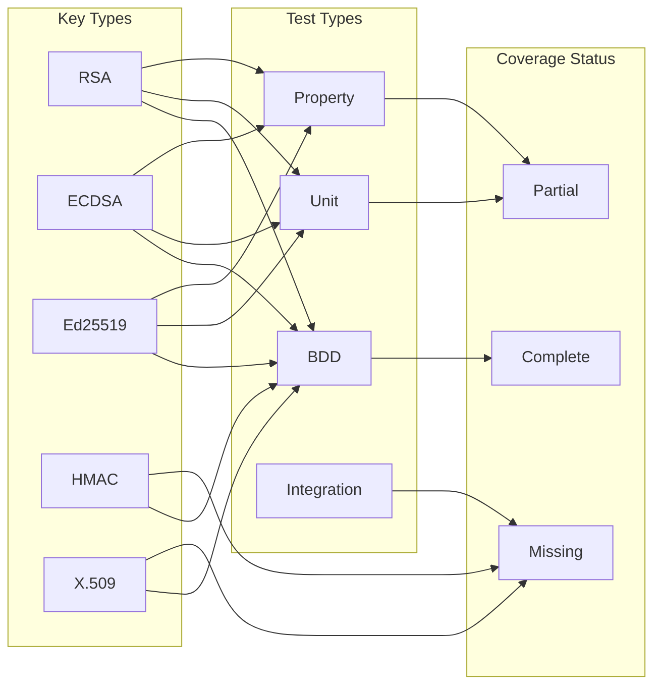
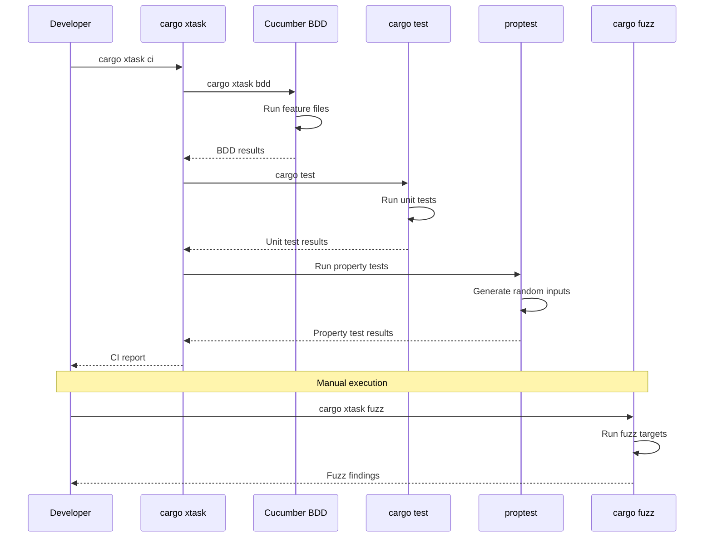
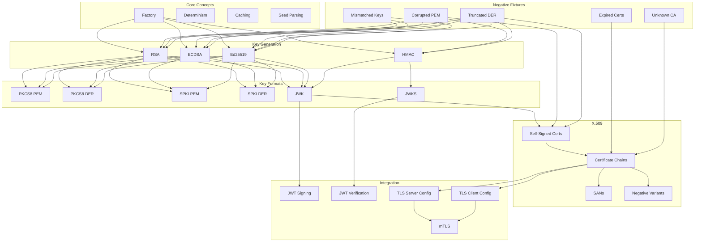

# Test Architecture Overview

```mermaid
graph TB
    subgraph BDD Tests
        BDD1[rsa.feature]
        BDD2[ecdsa.feature]
        BDD3[ed25519.feature]
        BDD4[hmac.feature]
        BDD5[jwk.feature]
        BDD6[jwks.feature]
        BDD7[negative.feature]
        BDD8[seed.feature]
        BDD9[tempfile.feature]
        BDD10[x509.feature]
        BDD11[chain.feature]
        BDD12[cross_key.feature]
    end

    subgraph Proposed BDD Tests
        PBDD1[jwt.feature - NEW]
        PBDD2[tls.feature - NEW]
        PBDD3[edge_cases.feature - NEW]
    end

    subgraph Unit Tests
        UT1[uselesskey-core]
        UT2[uselesskey-rsa]
        UT3[uselesskey-ecdsa]
        UT4[uselesskey-ed25519]
        UT5[uselesskey-x509 - MISSING]
        UT6[uselesskey-hmac - MISSING]
        UT7[uselesskey-jwk - MISSING]
    end

    subgraph Adapter Tests - MISSING
        AT1[uselesskey-jsonwebtoken]
        AT2[uselesskey-rustls]
        AT3[uselesskey-ring]
        AT4[uselesskey-aws-lc-rs]
        AT5[uselesskey-rustcrypto]
    end

    subgraph Integration Tests - MISSING
        IT1[JWT End-to-End]
        IT2[TLS Handshake]
        IT3[mTLS Scenarios]
        IT4[Key Rotation]
    end

    subgraph Property Tests
        PT1[core_prop.rs]
        PT2[rsa_prop.rs]
        PT3[negative_prop.rs]
    end

    subgraph Fuzz Tests
        FT1[der_ops.rs]
        FT2[pem_corrupt.rs]
        FT3[rsa_pkcs8_pem_parse.rs]
    end

    BDD1 --> UT1
    BDD2 --> UT3
    BDD3 --> UT4
    BDD4 --> UT6
    BDD5 --> UT7
    BDD6 --> UT7
    BDD7 --> UT1
    BDD8 --> UT1
    BDD9 --> UT1
    BDD10 --> UT5
    BDD11 --> UT5
    BDD12 --> UT1

    PBDD1 --> AT1
    PBDD2 --> AT2
    PBDD3 --> UT1

    UT1 --> PT1
    UT2 --> PT2
    UT1 --> PT3

    UT1 --> FT1
    UT1 --> FT2
    UT2 --> FT3

    IT1 --> AT1
    IT2 --> AT2
    IT3 --> AT2
    IT4 --> UT7

    style BDD1 fill:#90EE90
    style BDD2 fill:#90EE90
    style BDD3 fill:#90EE90
    style BDD4 fill:#90EE90
    style BDD5 fill:#90EE90
    style BDD6 fill:#90EE90
    style BDD7 fill:#90EE90
    style BDD8 fill:#90EE90
    style BDD9 fill:#90EE90
    style BDD10 fill:#90EE90
    style BDD11 fill:#90EE90
    style BDD12 fill:#90EE90

    style PBDD1 fill:#FFD700
    style PBDD2 fill:#FFD700
    style PBDD3 fill:#FFD700

    style UT5 fill:#FF6B6B
    style UT6 fill:#FF6B6B
    style UT7 fill:#FF6B6B

    style AT1 fill:#FF6B6B
    style AT2 fill:#FF6B6B
    style AT3 fill:#FF6B6B
    style AT4 fill:#FF6B6B
    style AT5 fill:#FF6B6B

    style IT1 fill:#FF6B6B
    style IT2 fill:#FF6B6B
    style IT3 fill:#FF6B6B
    style IT4 fill:#FF6B6B
```

## Test Coverage Matrix

## Test Execution Flow

## BDD Test Hierarchy

## Legend

- **Green boxes**: Existing tests (complete)
- **Yellow boxes**: Proposed new tests
- **Red boxes**: Missing tests
- **Solid lines**: Direct dependencies
- **Dashed lines**: Indirect relationships
